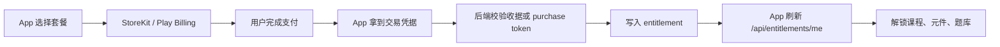

# 电工大师海外教育付费 App 方案

调研日期：2026-06-11  
目标：把当前 Web + 微信小程序版电路仿真工作台，升级为可在海外发行的教育类付费 App，覆盖 iOS、Android、Web 与后续小程序渠道。

## 结论

当前项目已经具备教育 App 的核心内容资产：电路仿真、弱电元件库、训练挑战、知识验证、专业考试模拟、虚拟万用表、素材规格库和商业化权限模型。现阶段没有原生 iOS/Android 工程，因此海外 App 化建议走“现有 Taro H5 产物 + Capacitor 原生壳 + 原生内购插件 + 后端权益服务”的路线，先快速进入 TestFlight 和 Google Play 内测，再按留存和付费数据决定是否重写原生交互。

首发商业模型建议采用免费体验 + 订阅 + 一次性解锁。教育课程、仿真训练、考试题库、专业元件包属于 App 内可消费的数字内容，在 App Store 和 Google Play 上应默认接入 Apple In-App Purchase 与 Google Play Billing。Web 端可以用 Stripe，但原生 App 内不要直接引导用户去 Web 付款，除非后续按地区和官方 entitlement 单独设计。

首发地区建议先做英语市场：美国、加拿大、澳大利亚、英国、新加坡、菲律宾、印度、马来西亚。第一批语言为 `en-US`、`zh-CN`、`zh-TW`，第二批为 `es-ES`、`ja-JP`、`ko-KR`、`de-DE`。产品定位先面向 13+ 且已有电学/弱电基础的职业教育用户，核心诉求是电工证备考、弱电施工、工控维护和获得更多工作机会；不进入 Apple Kids Category，不加入广告 SDK，降低儿童隐私和第三方追踪审核风险。

## 当前项目基线

| 项目 | 当前状态 | App 化影响 |
| --- | --- | --- |
| 技术栈 | Taro 4 + React 18 + TypeScript | 可继续输出 H5，适合用 WebView 原生壳承载 |
| 构建脚本 | `build:h5`、`build:weapp`、`test:compat` | 缺少 `build:ios`、`build:android`、签名和商店发布脚本 |
| 核心仿真 | `src/core/simulator.ts` 与元件注册表 | 可复用，不依赖 DOM 或平台能力 |
| 教育能力 | 课程、训练、题库、考试、素材库 | 适合拆成免费/付费权益 |
| 商业化占位 | `src/core/commercial.ts` 有套餐、门禁和 API 契约 | 需要接真实账号、支付、权益同步 |
| 移动 UI | 已有移动底部导航和横向画布 | 需要补齐 iOS safe area、离线状态、原生支付弹窗和恢复购买 |
| 原生工程 | 无 `ios/`、`android/` 目录 | 需要新增 Capacitor 或 Taro React Native 路线 |

## 打包路线

### 推荐路线：Capacitor 包 H5

采用 Capacitor 的原因：

- 当前 Taro H5 已经通过 E2E 和兼容性构建，复用成本最低。
- 电路仿真核心是前端计算和可视交互，首版不需要重度原生 UI。
- Capacitor 可以接入 StoreKit、Google Play Billing、Push、Deep Link、File、Share、Crash 等原生能力。
- iOS/Android 的发布产物、签名、TestFlight、Play Internal Testing 都能走标准原生链路。

建议新增目录和脚本：

```text
capacitor.config.ts
ios/
android/
fastlane/
scripts/release/
```

建议新增脚本：

```json
{
  "build:app:web": "taro build --type h5",
  "cap:sync": "npx cap sync",
  "app:sync": "npm run build:app:web && npm run cap:sync",
  "app:open:ios": "npx cap open ios",
  "app:open:android": "npx cap open android",
  "build:android:aab": "npm run app:sync && cd android && ./gradlew bundleRelease",
  "test:app:preflight": "npm run typecheck && npm run test:physics && npm run test:e2e && npm run test:compat"
}
```

Capacitor 配置建议：

```ts
const config = {
  appId: 'com.electricmaster.learn',
  appName: 'Circuit Master',
  webDir: 'dist/h5',
  server: {
    androidScheme: 'https'
  }
}
```

App 包名建议：

- iOS Bundle ID：`com.electricmaster.learn`
- Android applicationId：`com.electricmaster.learn`
- 海外品牌名：`Circuit Master`
- 中文品牌名：`电工大师`

### 备选路线：Taro React Native

只有在以下情况出现时再考虑 Taro React Native 或纯原生重写：

- WebView 内画布拖拽在低端 Android 上明显卡顿。
- 需要蓝牙、电气硬件采集、AR 实物识别、摄像头测量等强原生能力。
- 商店审核认为 WebView 内容占比过高，要求更多原生体验。

首版不建议直接切 RN，因为当前业务核心和 UI 都在 Taro H5 上，直接迁移会扩大风险。

## iOS 发布要求

截至 2026-06-11，官方要求需要重点关注：

- 上传 App Store Connect 的 iOS/iPadOS App 需要使用 iOS & iPadOS 26 SDK 或更新版本构建，Apple 官方提交页说明该要求从 2026-04-28 开始生效。
- App Store 会审核 App、更新、Bundle、内购和 App Event，需要提前准备隐私、安全、可靠性和审核说明。
- 付费解锁功能、订阅、专业内容、题库和课程等数字内容，必须在 App 内提供 In-App Purchase。多平台服务可以允许用户访问其他平台已购买内容，但 App 内也需要提供对应 IAP 购买入口。
- App Privacy Details 是提交新 App 和更新的必填项，需要披露本 App 和第三方 SDK 的数据收集实践。
- 如果选择 Kids Category，会受到更严格限制，包括儿童数据、第三方分析、第三方广告、外链和购买入口。首发建议不进 Kids Category。

iOS 首发产物：

- `Archive` 产物：Xcode Organizer 上传或 CI 导出 `.ipa`。
- 分发渠道：TestFlight 内测，然后 App Store phased release。
- 必备页面：Privacy Policy、Terms of Use、Support、Account Deletion。
- 审核账号：提供可访问专业版内容的测试账号、IAP 测试说明、课程/题库/仿真入口说明。

## Android 发布要求

截至 2026-06-11，官方要求需要重点关注：

- Google Play 新 App 和更新需要 target Android 15，也就是 API level 35 或更高。
- Google Play 使用 Android App Bundle，也就是 `.aab`，作为主要发布格式。
- App 内购买数字商品、订阅、解锁功能和教育内容，默认必须使用 Google Play Billing。
- 需要填写 Data safety、隐私政策、内容分级、目标受众、广告声明、登录凭据说明。
- 如果 App 面向儿童或可能强烈吸引儿童，需要按 Google Play Families Policy 做目标受众、内容、广告和数据处理约束。

Android 首发产物：

- Release AAB：`android/app/build/outputs/bundle/release/app-release.aab`
- 签名：Google Play App Signing + 本地 upload key。
- 分发渠道：Internal testing -> Closed testing -> Production staged rollout。
- 审核账号：提供登录账号、付费权益测试路径、账号删除入口、无广告声明。

## 多语言方案

### 语言分层

首发语言：

- `en-US`：海外主语言和 App Store / Google Play 主 metadata。
- `zh-CN`：现有中文内容保留。
- `zh-TW`：面向港澳台、新加坡、海外华人。

第二阶段语言：

- `es-ES`：西语市场。
- `ja-JP`：日本技术教育市场。
- `ko-KR`：韩国教育市场。
- `de-DE`：德国职业教育和工程基础市场。

### 代码结构

建议新增：

```text
src/i18n/
  index.ts
  locales/
    en-US.json
    zh-CN.json
    zh-TW.json
  glossary/
    electrical.en-US.json
    electrical.zh-CN.json
```

核心原则：

- UI 文案全部改成 key，不在组件里硬编码中文。
- 课程、题库、元件说明、故障说明使用内容 ID + locale 文案。
- 电学术语维护独立 glossary，避免同一个词在课程、题库和元件库里翻译不一致。
- 数值、单位、日期、货币使用 `Intl`。
- 画布元件本身继续使用图像示意图，不用字母作为主要识别方式；文字只作为辅助标签。
- 截图、商店描述、关键词、订阅名称都要本地化。

### 内容数据模型

课程和题库不要直接把中文作为主键。建议：

```ts
type LocalizedText = Record<LocaleCode, string>

interface LessonContent {
  id: string
  title: LocalizedText
  summary: LocalizedText
  objectives: LocalizedText[]
  glossaryTerms: string[]
}
```

元件库建议保留技术参数为结构化字段，文案字段本地化：

```ts
interface ComponentContent {
  id: string
  kind: DeviceKind
  name: LocalizedText
  description: LocalizedText
  safetyNotes: LocalizedText[]
  specs: {
    voltage?: string
    current?: string
    resistance?: string
  }
}
```

### 翻译验收

- 每个 locale 的 key 覆盖率达到 100% 才允许发版。
- E2E 增加 `?locale=en-US`、`?locale=zh-TW` 的 smoke 测试。
- 所有按钮、底部导航、付费弹窗在 320px 宽度下不截断。
- 每个市场至少 5 张本地化截图。
- 电学专业词由人工复核，不能只依赖机器翻译。

## 付费设计

### 套餐

| 套餐 | 目标用户 | 权益 | 付费方式 |
| --- | --- | --- | --- |
| Free | 有基础的试用用户、备考初筛用户 | 基础强化回路、常见元件速查、少量排障任务、每日训练次数限制 | 免费 |
| Pro Monthly | 电工证备考、弱电施工、工控维护个人用户 | 全部元器件讲解、训练工位、知识题库、错题复训、虚拟万用表 | iOS/Android 订阅，Web Stripe |
| Pro Yearly | 长期备考和岗位提升用户 | Pro 全部权益，年付折扣 | iOS/Android 订阅，Web Stripe |
| Lifetime | 一次性买断用户 | 当前全部课程和元件包，未来大版本可另售 | 非消耗型 IAP / 一次性商品 |
| Team / Classroom | 学校、培训机构、企业 | 多席位、班级进度、题库报告、教师后台 | Web 合同/Stripe，App 内只登录消费权益 |

### 商品 ID

建议各平台商品 ID 使用同一语义前缀：

```text
pro_monthly
pro_yearly
lifetime_unlock
component_pack_industrial
component_pack_smart_home
assessment_pack_professional
```

App Store Connect 和 Play Console 的 product ID 可以保持一致，后端权益服务再映射到内部 entitlement：

```text
entitlement.pro
entitlement.lifetime
entitlement.component.industrial
entitlement.component.smart_home
entitlement.assessment.professional
```

### 购买闭环



关键要求：

- 所有收据和 purchase token 必须服务端校验，不只信任前端。
- Webhook / Server Notification 必须幂等，防止重复发权益。
- 支持 Restore Purchases。
- 订阅过期、退款、撤销、宽限期、暂停都要同步到 entitlement。
- 原生 App 内的课程、题库和高级元件购买默认走 IAP / Play Billing。
- Web 端可以使用 Stripe，但原生 App 内不要出现“去网站购买更便宜”的默认引导。
- 如果未来要利用美国、欧盟、韩国、印度等地区的外部购买或替代支付规则，需要按地区开关、商店 entitlement、文案和法务复核单独设计。

### 后端数据模型

建议最小表结构：

```text
users
  id
  email
  locale
  country
  created_at

entitlements
  id
  user_id
  entitlement_key
  source_platform
  status
  valid_until
  created_at
  updated_at

store_transactions
  id
  user_id
  platform
  product_id
  transaction_id
  original_transaction_id
  purchase_token
  status
  raw_payload
  created_at

billing_events
  id
  platform
  event_id
  event_type
  transaction_id
  processed_at
  raw_payload
```

### API

建议新增或落实：

```text
POST /api/auth/login
POST /api/auth/oauth/apple
POST /api/auth/oauth/google
GET  /api/entitlements/me
POST /api/billing/ios/verify
POST /api/billing/google/verify
POST /api/billing/stripe/webhook
POST /api/billing/apple/notifications
POST /api/billing/google/rtdn
POST /api/account/delete
GET  /api/catalog
GET  /api/i18n/:locale
POST /api/telemetry/events
```

## 账号与学习进度

首发必须支持：

- 匿名试用：进入 App 不强制登录，可以体验基础电路。
- 账号登录：Apple、Google、邮箱验证码。
- 购买后绑定账号：购买成功后引导绑定邮箱或 OAuth，降低换设备丢权益风险。
- 跨端同步：课程进度、题库记录、错题本、收藏元件、训练报告。
- 账号删除：App 内提供删除入口，后端异步清理个人数据和学习记录。

学习进度模型：

```text
lesson_progress
  user_id
  lesson_id
  status
  score
  last_circuit_snapshot

assessment_attempts
  user_id
  blueprint_id
  answers
  score
  readiness_status

circuit_snapshots
  user_id
  title
  model_json
  locale
  created_at
```

## 运营体系

### 运营后台

需要一个轻量后台，不建议把课程和付费活动都写死在前端。

后台能力：

- 课程管理：上下架课程、编辑本地化文案、绑定仿真模板。
- 元件包管理：新增元件、设置套餐等级、维护安全说明。
- 题库管理：题目版本、难度、知识点、语言版本、解析。
- 活动配置：新用户试用、年费折扣、学校批量码。
- 用户管理：查询权益、补发权益、处理退款争议。
- 内容审核：专业术语、图片示意图、风险提示人工审核。

### 数据指标

首发埋点只保留必要事件，不做广告追踪。

埋点落地采用双方案抽象：

- 国内包：`TELEMETRY_REGION=domestic`，输出 `cn-edu-v1` 事件包络，渠道可设为 `weapp`、`h5-cn`、`app-cn`，后续接神策、友盟、微信小程序分析或自建国内数据管道。
- 海外包：`TELEMETRY_REGION=overseas`，输出 `global-edu-v1` 事件包络，渠道可设为 `h5-global`、`app-global`，后续接 Firebase Analytics、GA4、App Store/Google Play campaign 或自建海外数据管道。
- 页面业务只调用统一事件 API，不直接依赖具体 SDK；打包时由构建常量决定 adapter 和 endpoint。
- 默认不采集广告 ID、通讯录、精确位置、照片、麦克风等敏感数据。

核心漏斗：

- `app_open`
- `onboarding_locale_selected`
- `career_path_selected`
- `first_fault_station_completed`
- `simulation_success`
- `training_started`
- `training_completed`
- `assessment_started`
- `paywall_viewed`
- `purchase_started`
- `purchase_completed`
- `purchase_failed`
- `restore_purchase_completed`
- `subscription_expired`

关键指标：

- D1/D7 留存。
- 职业路径选择完成率。
- 首个排障工位完成率。
- 免费到付费转化率。
- 订阅试用开启率和取消率。
- 课程完成率。
- 题库正确率提升。
- 退款率和支付失败率。
- 崩溃率、启动耗时、仿真帧率。

### 推送与生命周期

推送只用于学习提醒和课程更新，不用于强促销轰炸：

- 第 1 天：提醒完成所选取证/岗位路径的第一个排障工位。
- 第 3 天：推荐故障排查训练。
- 第 7 天：提醒考试模拟和年费优惠。
- 订阅临期：提醒恢复学习或续费，遵守平台订阅提示规则。

### 客服与信任

必须准备：

- 支持邮箱。
- FAQ：购买失败、恢复购买、换设备、退款、课程内容、账号删除。
- App 内反馈入口。
- 审核专用账号和说明。
- 安全声明：仿真仅用于教育，不替代真实电工操作资质和现场安全规范。

## 隐私、合规和年龄策略

建议首发策略：

- 标注为教育工具，目标年龄 13+ 或更高，避免进入儿童专属分类。
- 不接第三方广告 SDK。
- 分析 SDK 只采集匿名产品事件，不采集精确位置、通讯录、照片、麦克风等敏感权限。
- 不请求不必要的系统权限。
- 清晰披露账号、学习进度、购买记录和崩溃日志的用途。
- 默认关闭个性化广告，因为首发不做广告。
- 提供账号删除和数据导出路径。

如果未来面向 K-12 儿童市场：

- 单独建立儿童版本或儿童模式。
- 关闭第三方广告和大部分第三方分析。
- 增加家长门、家长同意、学校/教师账号。
- 重新做 COPPA、GDPR-K、各地区儿童隐私法务复核。

## 商店素材

### App Store / Google Play listing

首发 metadata：

- App 名称：`Circuit Master`
- 副标题：`Learn circuits with interactive simulation`
- 分类：Education
- 关键词：circuit simulator, electrical training, electronics, STEM, wiring, multimeter, PLC basics
- 简短描述：面向初学者和职业教育的交互式电路仿真学习 App。
- 长描述：突出视觉元件、拖拽接线、点灯/电扇/电机反馈、虚拟万用表、故障排查、题库和专业元件包。

截图清单：

1. 视觉化电路画布。
2. 灯泡点亮和电扇转动效果。
3. 弱电元件库和图像示意图。
4. 虚拟万用表读数。
5. 故障排查训练。
6. 知识题库和考试模拟。
7. Pro 权益页。

本地化截图至少覆盖 `en-US`、`zh-CN`、`zh-TW`。

## 发布与 CI

### 分支和环境

建议环境：

```text
dev
staging
production
```

建议配置：

```text
APP_ENV=staging
API_BASE_URL=https://api-staging.circuitmaster.app
SENTRY_DSN=
REVENUECAT_API_KEY=            # 如果使用 RevenueCat
STRIPE_PUBLIC_KEY=             # Web only
APPLE_BUNDLE_ID=com.electricmaster.learn
ANDROID_PACKAGE_NAME=com.electricmaster.learn
```

### CI 步骤

```text
npm ci
npm run typecheck
npm run test:physics
npm run test:e2e
npm run test:compat
npm run build:app:web
npx cap sync
cd android && ./gradlew bundleRelease
xcodebuild archive ...
```

推荐使用：

- GitHub Actions：跑 Web/Taro 测试和 Android AAB。
- macOS runner：跑 iOS archive。
- fastlane：上传 TestFlight、Play Internal Testing、metadata、screenshots。
- App Store Connect API：自动化 iOS metadata。
- Google Play Developer API：自动化 Android 轨道发布。

### 发布闸门

进入 TestFlight / Internal testing 前必须满足：

- `npm run test:app:preflight` 通过。
- Android AAB 可安装，target API 达标。
- iOS Archive 可上传，SDK 达标。
- IAP / Play Billing 沙盒购买、恢复购买、退款同步通过。
- 隐私政策、服务条款、支持页、账号删除页都是 HTTPS 200。
- 审核账号可以访问付费内容。
- Data safety 和 App Privacy 与 SDK 实际采集一致。
- 每个支持语言的商店截图和 metadata 完整。

## 分阶段落地

### P0：商业和合规定稿，1 周

- 确定海外品牌、包名、首发国家、首发语言。
- 确定付费模型：免费体验、月付、年付、买断、学校团队。
- 注册 Apple Developer、Google Play Console、Stripe、域名和支持邮箱。
- 准备隐私政策、服务条款、账号删除说明。

验收：商店账号、域名、政策页面、商品 ID 表和首发市场清单确认。

### P1：App 壳和构建，1 到 2 周

- 接入 Capacitor。
- 新增 iOS 和 Android 工程。
- 完成 H5 到原生壳的构建同步。
- 配置 safe area、状态栏、启动图、图标、深链。
- 建立 Android AAB 和 iOS Archive 脚本。

验收：真机可安装，画布拖拽、接线、点亮、风扇转动、移动导航都可用。

### P2：多语言，1 到 2 周

- 新增 i18n 框架和 locale 资源。
- UI 文案 key 化。
- 课程、题库、元件说明结构化本地化。
- 完成 `en-US`、`zh-CN`、`zh-TW`。
- 增加 locale E2E smoke。

验收：三种语言切换无空 key，主要页面无截断，商店 metadata 完成。

### P3：账号和付费，2 到 4 周

- 后端用户、权益、交易表。
- Apple 登录、Google 登录、邮箱验证码。
- iOS StoreKit 和 Google Play Billing。
- Stripe 仅用于 Web。
- 服务端收据校验、webhook、恢复购买。
- Paywall、套餐页、权益门禁接入现有 `commercial.ts`。

验收：沙盒购买、恢复、退款、订阅过期、跨设备登录权益同步全部通过。

### P4：运营后台，2 到 3 周

- 课程、元件、题库、活动配置后台。
- 远程配置和功能开关。
- 埋点、崩溃、性能和支付漏斗。
- 客服和审核账号工具。

验收：运营可不发版调整课程上下架、Pro 门禁和活动文案。

### P5：商店内测和发行，1 到 2 周

- TestFlight 外部测试。
- Google Play Internal / Closed testing。
- 收集崩溃、性能、留存、支付失败。
- 完成 App Privacy、Data safety、内容分级、截图和审核说明。
- 分阶段发布。

验收：iOS 和 Android 都进入生产发布或 staged rollout。

## 技术任务清单

### 前端

- 新增 `src/i18n`，完成文案 key 化。
- 新增 `src/platform/nativeBridge.ts`，封装购买、恢复购买、设备、深链、推送。
- 改造 `commercial.ts`，让权益来源从 mock 切换为 `/api/entitlements/me`。
- Paywall 组件支持平台差异：iOS、Android、Web。
- 移动端画布补齐 safe area、横竖屏和低端设备性能测试。
- 增加 app 环境变量和构建目标识别。

### 原生

- 接入 Capacitor iOS / Android。
- 配置包名、版本号、图标、启动图、权限。
- iOS 接 StoreKit 2 或成熟内购插件。
- Android 接 Play Billing Library 或成熟内购插件。
- 配置 Universal Links / App Links。
- 配置 Crash、Push、Deep Link。

### 后端

- 用户系统和 OAuth。
- 权益服务。
- 收据校验服务。
- Billing webhook。
- 学习进度同步。
- 运营后台 API。
- 审核账号和后台手动补发权益。

### 测试

- Web E2E 保持现有覆盖。
- 新增 locale E2E。
- 新增 paywall 和权益单测。
- 新增 IAP 沙盒手工测试清单。
- Android 真机：低端机、平板、横竖屏。
- iOS 真机：iPhone SE、主流 iPhone、iPad。

## 风险和处理

| 风险 | 影响 | 处理 |
| --- | --- | --- |
| WebView 性能不足 | 画布拖拽、导线渲染卡顿 | 优先优化 DOM 和渲染；必要时把画布改 Canvas/SVG 层 |
| IAP 审核失败 | 无法付费上线 | App 内数字内容默认走 IAP / Play Billing，审核说明写清楚 |
| 多语言翻译不专业 | 教育可信度下降 | 建 glossary，电学术语人工复核 |
| 儿童隐私误判 | 审核变严或下架风险 | 首发定位 13+，不进 Kids Category，不接广告 |
| 权益不同步 | 用户投诉和退款 | 后端收据校验、webhook 幂等、恢复购买 |
| 商店 metadata 不完整 | 审核延迟 | 使用 fastlane 管理截图、描述、关键词 |
| 入口包体偏大 | H5 性能和商店体验 | 拆分课程/题库资源，按 locale 和课程懒加载 |

## 官方资料

- Apple App Store 提交要求：https://developer.apple.com/app-store/submitting/
- Apple App Review Guidelines：https://developer.apple.com/app-store/review/guidelines/
- Apple App Privacy Details：https://developer.apple.com/app-store/app-privacy-details/
- Apple App Store 本地化：https://developer.apple.com/localization/
- App Store Connect 本地化说明：https://developer.apple.com/help/app-store-connect/manage-app-information/localize-app-information/
- Google Play Billing：https://developer.android.com/google/play/billing
- Google Play Payments Policy：https://support.google.com/googleplay/android-developer/answer/10281818
- Android App Bundle：https://developer.android.com/guide/app-bundle
- Google Play target API 要求：https://developer.android.com/google/play/requirements/target-sdk
- Google Play Data safety：https://support.google.com/googleplay/android-developer/answer/10787469
- Google Play Families Policy：https://support.google.com/googleplay/android-developer/answer/9893335
